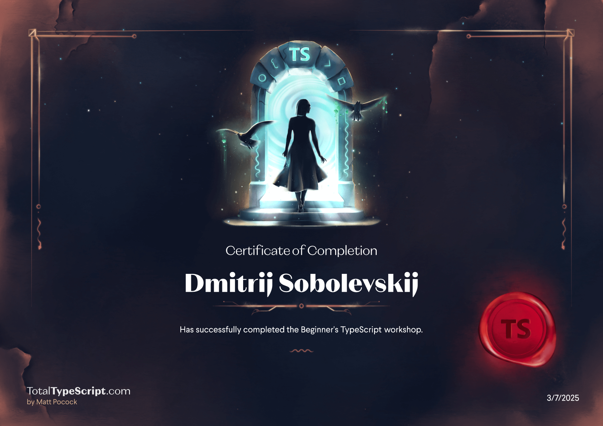
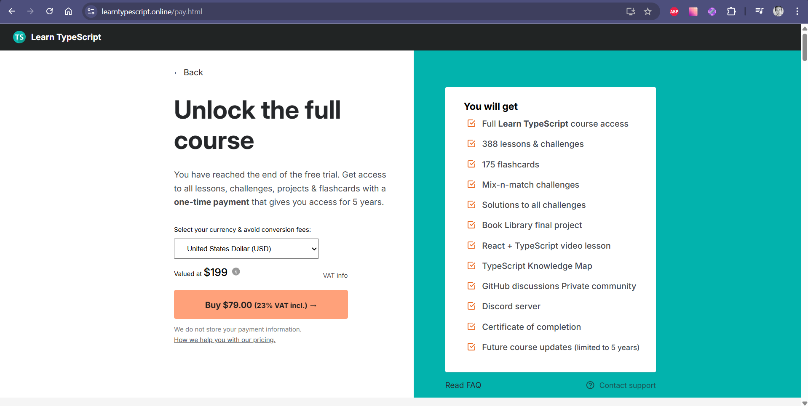

# My TypeScript Journey 👨‍🚀

---

### Course 'Beginner's TypeScript' 🧙

Here is my result of the course:

**Feedback:**
Overall, the course is very good. It covers a wide range of information. The course is well-organized and allows you to gain confident knowledge of working with TypeScript. I learned about variable types, functions, and the types of errors that TypeScript reports. Most importantly, I was introduced to the official TypeScript documentation, which I consider very important and useful.

---

### Course 'Learn TypeScript step by step in an interactive environment' 💡

Here is my result of the course:

**Feedback:**
This course is also very good, where you confidently learn TypeScript step by step. First, declaring the type of a simple variable, then integrating TypeScript into your project, and so on. All the information is very well-structured and presented in an attractive and convenient working environment.

---

### Reflections
Overall, I liked the second course even more due to the gradual presentation of information in a logical order (A to Z). The only downside is that only seven chapters are available for free. On the other hand, the first course is more difficult and challenging, providing opportunities to apply all your skills in searching for and studying new information.
